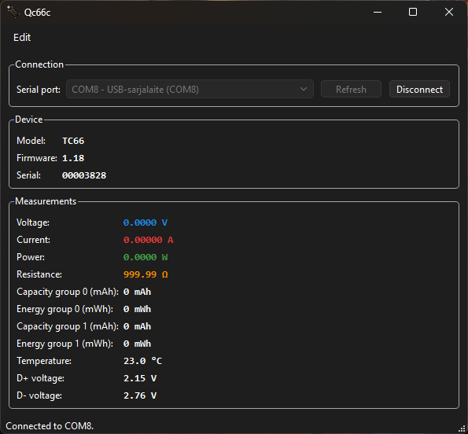

# Qc66c

A small Qt 6 (Widgets) desktop application that reads live measurements from an
RDTech TC66 / TC66C USB current & voltage meter over its USB CDC serial port and
displays them stacked vertically.



Author: Nita Vesa

## Features

- Enumerates serial ports on Windows and Linux and pre-selects the one whose
  USB IDs are `28E9:018A` (the TC66). It never opens a port automatically.
- Lets the user pick any other port and connect/disconnect with a button.
- Polls the meter (`getva`, 100 ms) and displays voltage, current, power,
  resistance, capacity/energy (two groups), temperature, and D+/D- line voltage.
- Verifies the device response (AES-256-ECB decryption, `pac1/2/3` magic,
  CRC-16/MODBUS checksums) and re-synchronises on invalid frames.
- Colour-codes the voltage, current, power and resistance readouts, with the
  colours configurable from **Edit > Preferences...** and persisted between
  runs.
- Lets each measurement be shown or hidden, and the measurement font (family,
  size and bold) chosen, from the same Preferences dialog.
- Can connect automatically on start-up when the TC66 port is present, and
  remembers the window position and size between runs.

## Protocol

Communication follows the publicly documented protocol:
- https://sigrok.org/wiki/RDTech_TC66C
- https://github.com/Ralim/TC66C

Summary: serial 115200 8N1, request `getva`, 192-byte encrypted response
(3 x 64-byte `pac` blocks). The response is decrypted with AES-256 in ECB mode
using the static key documented by sigrok, then each block's CRC-16/MODBUS is
checked.

## Requirements

- Qt 6.10.3 or newer (Widgets module only)
- CMake 3.16+
- A C++17 compiler (MinGW, MSVC or GCC/Clang)

> Note: this project deliberately does **not** depend on the Qt Serial Port
> module. The serial transport uses the Windows API
> (`CreateFile`/`ReadFile`/`WriteFile` and SetupAPI) on Windows and POSIX
> termios plus sysfs on Linux, so no extra Qt component is needed. On Linux the
> user must be able to access the device, usually by being in the `dialout`
> group.

## Build

The project targets Qt 6.10.3, the version the release workflow uses.

### Windows (MinGW)

With Qt's bundled MinGW kit (paths shown are for a default Qt install, adjust to
your own):

```powershell
$env:Path = "C:\Qt\Tools\mingw1310_64\bin;C:\Qt\Tools\Ninja;C:\Qt\Tools\CMake_64\bin;$env:Path"
cmake -S . -B build -G Ninja -DCMAKE_BUILD_TYPE=Release `
    -DCMAKE_PREFIX_PATH=C:/Qt/6.10.3/mingw_64 `
    -DCMAKE_C_COMPILER=C:/Qt/Tools/mingw1310_64/bin/gcc.exe `
    -DCMAKE_CXX_COMPILER=C:/Qt/Tools/mingw1310_64/bin/g++.exe
cmake --build build
```

### Linux

Install the Qt 6 development packages (or use the Qt online installer), then:

```sh
cmake -S . -B build -G Ninja -DCMAKE_BUILD_TYPE=Release
cmake --build build
cmake --install build --prefix "$PWD/dist/portable"   # bundles the Qt runtime
```

Or simply open `CMakeLists.txt` in Qt Creator and build with any Qt 6 kit.

## Run

### Windows

The application needs the Qt runtime, so add Qt's `bin` directory to `PATH`
(or deploy the DLLs next to the executable):

```powershell
$env:Path = "C:\Qt\6.10.3\mingw_64\bin;$env:Path"
.\build\Qc66c.exe
```

To produce a self-contained folder:

```powershell
C:\Qt\6.10.3\mingw_64\bin\windeployqt.exe .\build\Qc66c.exe
```

### Linux

Run the binary directly; the Qt runtime is located via the build RPATH (or, for
an installed/bundled copy, from the bundled libraries):

```sh
./build/Qc66c
```

## Usage

1. Connect the TC66 meter to the PC via its micro-USB connector.
2. Start the application. The TC66 port is selected automatically if present.
3. Pick a different port if needed and click **Connect**.
4. Live values update several times per second. Click **Disconnect** to stop.
5. Open **Edit > Preferences...** to configure:
   - **General** — connect automatically on start-up when the TC66 port is available.
   - **Measurements** — tick the values to display.
   - **Font** — family, size and bold for the measurement values.
   - **Colours** — colours for the voltage, current, power and resistance values.
   Changes apply on **OK** and are saved for the next run; **Restore Defaults**
   resets all of them.

## Releases

Pushing a semantic-version tag (for example `v0.6.0`) runs the `Release` GitHub
Actions workflow, which builds and publishes:

- `Qc66c-<version>-win64-portable.zip` - a self-contained folder with the
  executable, all Qt dependencies and the MinGW runtime.
- `Qc66c-<version>-win64-setup.exe` - a per-machine Windows installer.
- `Qc66c-<version>-linux-x86_64.tar.gz` - a self-contained folder with the
  executable and the bundled Qt runtime.
- `Qc66c-<version>-Linux.deb` - a Debian/Ubuntu package with the bundled Qt
  runtime.

The workflow can also be started manually from the Actions tab; leave the
version input blank to use the CMake project version.

## License

Released under the BSD 3-Clause License. See [LICENSE](LICENSE) for the full
text. Copyright (c) 2026 Nita Vesa.

The bundled AES implementation in `third_party/tiny-aes-c` is a separate
third-party component released into the public domain under the Unlicense.

## Project layout

```
CMakeLists.txt
LICENSE
src/
  main.cpp            Application entry point
  MainWindow.*        Port selector and vertical readout
  Tc66Device.*        Polling, receive buffering, frame handling
  Tc66Protocol.*      AES-256-ECB decrypt, CRC-16/MODBUS, packet parsing
  PreferencesDialog.* Appearance preferences dialog (visibility, font, colours)
  SerialPort.*        Platform-neutral serial interface + TC66 lookup
  SerialPortWin.*     Win32 serial transport + COM port enumeration
  SerialPortPosix.*   POSIX termios transport + sysfs enumeration
resources/            Icons, screenshot, desktop entry and Qt/Windows resources
third_party/tiny-aes-c/  Public-domain AES implementation (Unlicense)
```
